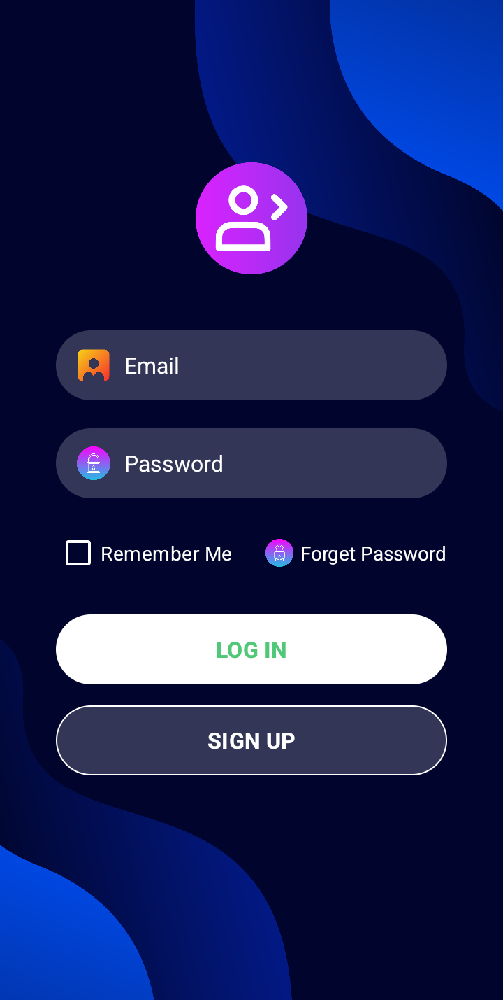

# Ứng dụng Đăng Nhập (Login App)

Một ứng dụng đăng nhập đơn giản cho Android, cung cấp giao diện người dùng thân thiện và chức năng đăng nhập cơ bản.

## Mô tả

Ứng dụng "Login App" cho phép người dùng đăng nhập bằng email và mật khẩu, với tính năng "Remember Me" để giữ lại thông tin đăng nhập cho các lần sau. Giao diện trực quan, dễ sử dụng, được thiết kế để mang lại trải nghiệm tốt nhất cho người dùng.

## Tính năng chính

- Đăng nhập bằng email và mật khẩu
- Hỗ trợ tính năng "Remember Me" để lưu thông tin đăng nhập
- Hiển thị thông báo và thông tin lỗi khi nhập sai
- Tích hợp chức năng quên mật khẩu
- Nút đăng ký chuyển đến màn hình đăng ký (chưa được triển khai)

## Hình ảnh minh họa

### Màn hình chính của ứng dụng

## Cấu trúc ứng dụng

Ứng dụng bao gồm một màn hình chính với các thành phần:

1. **Ô nhập email**: Nhập địa chỉ email
2. **Ô nhập mật khẩu**: Nhập mật khẩu
3. **Checkbox "Remember Me"**: Lưu thông tin đăng nhập
4. **Nút Đăng Nhập**: Thực hiện đăng nhập
5. **Nút Đăng Ký**: Chuyển đến màn hình đăng ký
6. **Liên kết quên mật khẩu**: Xử lý quên mật khẩu

## Luồng hoạt động

1. Người dùng nhập email và mật khẩu.
2. Nhấn nút Đăng Nhập.
3. Hệ thống xác thực và thông báo trạng thái đăng nhập.
4. Có thể tiếp tục đến màn hình đăng ký hoặc quên mật khẩu khi cần.

## Xử lý trường hợp đặc biệt

- **Email hoặc mật khẩu trống**: Hiển thị thông báo lỗi tương ứng.
- **Thông tin đăng nhập không chính xác**: Hiển thị thông báo lỗi khi đăng nhập không thành công.

## Yêu cầu hệ thống

- Android 14.0 (API level 34 - "UpsideDownCake")
- Android Studio

## Cách cài đặt

1. Clone repository này về máy local.
2. Mở dự án bằng Android Studio.
3. Sync Gradle và build project.
4. Chạy ứng dụng trên thiết bị thật hoặc máy ảo.

## Công nghệ sử dụng

- Java
- Android SDK
- LinearLayout và RelativeLayout cho giao diện
- Toast cho thông báo người dùng

## Thiết kế giao diện

- Giao diện hiện đại với các nút và biểu tượng trực quan.
- Hình nền đẹp và dễ nhìn, góp phần làm nổi bật các thành phần.
- Bố cục hợp lý, dễ dàng sử dụng trên thiết bị di động.

## Giấy phép

Dự án được phân phối dưới giấy phép MIT. Xem file `LICENSE` để biết thêm chi tiết.

## Tác giả

© 2025 - Được phát triển bởi Eggpant203 🍆

---

_Lưu ý: Đây là ứng dụng đăng nhập đơn giản cho mục đích học tập. Mọi đóng góp và phản hồi đều được chào đón._